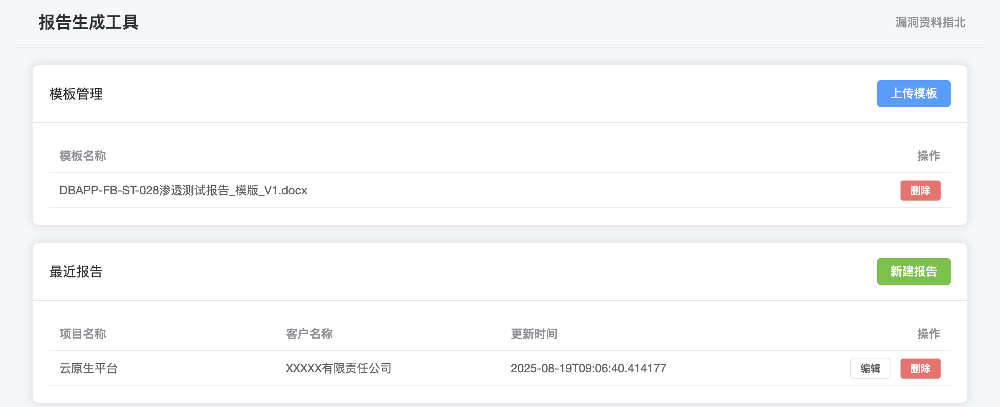
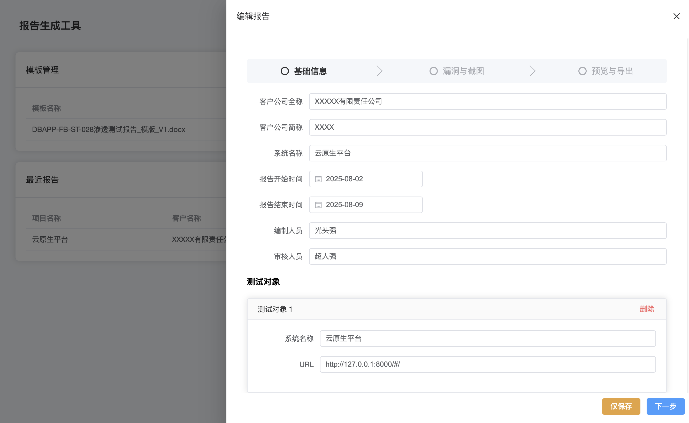
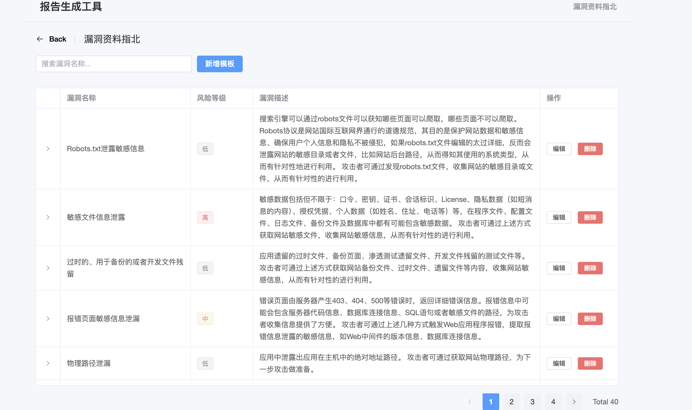
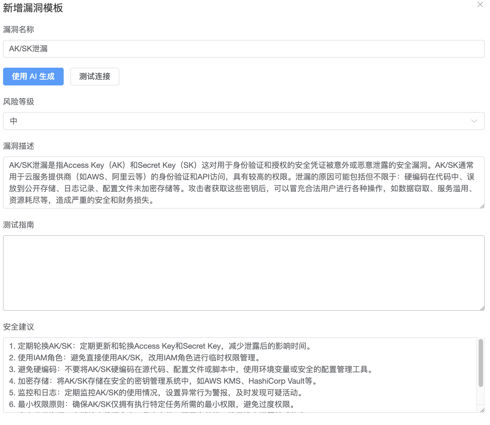

# 自动化安全测试报告生成器

这是一个基于 FastAPI 和 Vue.js 的 Web 应用程序，旨在简化和自动化安全测试报告的生成过程。

## 主要功能

- **模板管理**: 上传和管理 `.docx` 格式的报告模板。

  

  

  

- **报告生命周期管理**: 创建、编辑、查看和删除安全测试报告。

- **漏洞知识库**: 管理和维护常见的漏洞模板。

- **AI 助力的内容生成**: 集成AI模型，可根据漏洞名称自动生成详细的漏洞描述和修复建议。

  


## 安装与启动

### 1. 克隆项目
```bash
git clone [your-repository-url]
cd [project-directory]
```

### 2. 安装依赖
```bash
pip install -r requirements.txt
```

### 3. 配置环境

本项目使用 `.env` 文件来管理敏感配置信息，例如您的API密钥。

1.  将项目根目录下的 `.env.example` 文件复制一份并重命名为 `.env`。
2.  打开 `.env` 文件并填入您的配置信息。

```ini
# .env 文件内容示例

# 必需：您的 API 密钥
OPENAI_API_KEY="sk-..."

# 可选：自定义 API 的 URL 
OPENAI_API_BASE="https://api.openai.com/v1"

# 可选：自定义模型名称
OPENAI_MODEL_NAME="gpt-3.5-turbo"
```

### 4. 启动应用

```bash
python3 main.py
```

应用将在 `http://127.0.0.1:8000` 启动。